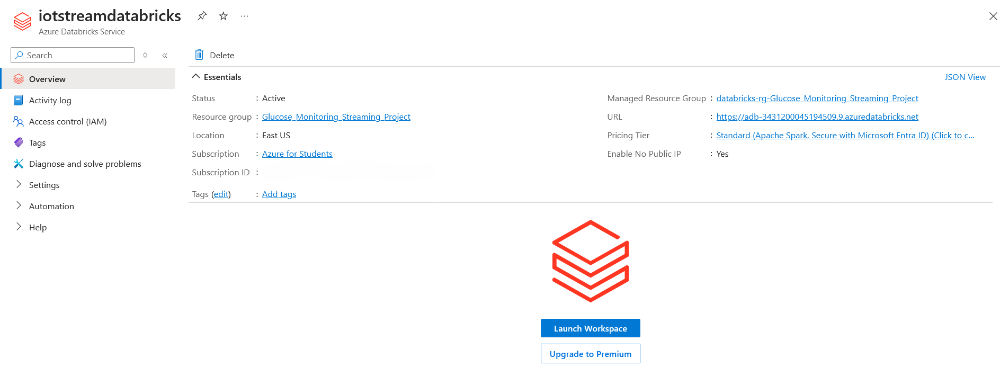

# Table of Contents

- [Overview](#overview)
- [Project Structure](#project-structure)

- [Scenario](#scenario)
    - [Target Patients](#target-patients)
    - [Continuous Glucose Monitoring System (CGM)](#continuous-glucose-monitoring-system-cgm)
    - [Subscribers: Doctors and Relatives](#subscribers-doctors-and-relatives)
    - [Telegram Channels For Alerts](#telegram-channels-for-alerts)
    - [Goals And Benefits](#goals-and-benefits)

- [Database Design](#database-design)
    - [Tables](#tables)
    - [Relationships](#relationships)
    - [The Alert Table Trigger](#the-alert-table-trigger)
        
- [Simulation Design](#simulation-design)
    - [Glucose Data Simulation](#glucose-data-simulation)
        - [User Behavior](#user-behavior)
        - [Location](#location)
        - [Device Disconnection Periods](#device-disconnection-periods)
        - [User-Specific Intervals](#user-specific-intervals)
    - [Device Data Simulation](#device-data-simulation)

- [Data Pipeline Architecture](#data-pipeline-architecture)
    - [Azure Cloud Services](#azure-cloud-services)
        - [Azure Database for MySQL](#azure-database-for-mysql)
        - [Azure Event Hubs](#azure-event-hubs)
        - [Azure Functions](#azure-functions)
        - [Azure Databricks](#azure-databricks)
        - [Azure Cache for Redis](#azure-cache-for-redis)
        - [Azure Virtual Machines](#azure-virtual-machines)
        - [Azure Blob Storage](#azure-blob-storage)
    - [Debezium](#debezium)
        - [Source Connector](#source-connector)
        - [Debezium Server](#debezium-server)
    - [DuckDB](#duckdb)
        - [Role Of DuckDB And Design Considerations](#role-of-duckdb-and-design-considerations)
    - [Glucose Device/IoT Simulation](#glucose-deviceiot-simulation)

    - [Stream Processing Pipeline](#stream-processing-pipeline)
        - [Redis Data Enrichment](#redis-data-enrichment)
        - [Real Time Live Streamlit Dashboard](real-time-live-streamlit-dashboard-python/README.md#real-time-live-streamlit-dashboard)
    - [Real Time Change Data Capture (CDC)](#real-time-change-data-capture-cdc)
    - [Batch Processing Pipeline](#batch-processing-pipeline)
        - [Daily Scheduled ETL](#daily-scheduled-etl)
        - [Monthly Trend Analysis](#monthly-trend-analysis)

- [Project Setup](#project-setup)
    - [Telegram Setup](#telegram-setup)
    - [Tables Preparation](#tables-preparation)
    - [Setting Up Azure Infrastructure With Terraform](#setting-up-azure-infrastructure-with-terraform)
    - [Running with Makefile](#running-with-makefile)
        - [Initial Setup](#initial-setup)
        - [Testing Stream Processing Pipeline](#testing-stream-processing-pipeline)
            - [Stopping Stream Processing Pipeline](#stopping-stream-processing-pipeline)
        - [Testing Cache Update With Real Time Change Data Capture](#testing-cache-update-with-real-time-change-data-capture)
        - [Testing Batch Processing Pipeline](#testing-batch-processing-pipeline)
            - [Testing Daily Scheduled ETL](#testing-daily-scheduled-etl)
            - [Testing Monthly Trend Analysis](#testing-monthly-trend-analysis)


# Overview

This was a final project I did for an elective course I took called Stream Processing. The objective was to design and build a **Real Time Continuous Glucose Monitoring(CGM) System**. The CGM system will allow subscribers such as doctors and relatives to receive real-time alerts through telegram channels when there is problem with the glucose levels of patients. It also allows the monitoring of the health of the devices used to collect the glucose data.

Most of the components of the system were designed and implemented using resources in **Azure cloud**.

This also involved coding the simulation of data to test the system I designed.                                       

The two types of data simulated in this project are:
1. **Glucose Data**: This data is simulated to represent the glucose levels of patients. 
2. **Device Data**: To monitor the status and health of the devices used to collect the glucose data.

# Project Structure
Data Engineering Real Time Continuous Glucose Monitoring System project is structured as follows:

```
.
├── Azure Databricks Notebooks
│   ├── Glucose Monitoring Streaming Business Logic.dbc
│   ├── Glucose Monitoring Streaming Business Logic.ipynb
│   ├── Trend Analysis.dbc
│   └── Trend Analysis.ipynb
├── Azure Functions
│   ├── CacheUpdate
│   │   ├── conn_config.py
│   │   ├── function_app.py
│   │   ├── host.json
│   │   ├── local.settings.json
│   │   └── requirements.txt
│   ├── DatabaseInserts
│   │   ├── function_app.py
│   │   ├── host.json
│   │   ├── local.settings.json
│   │   └── requirements.txt
│   ├── ETLDuckdb
│   │   ├── function_app.py
│   │   ├── glucose_aggregate.sql
│   │   ├── host.json
│   │   ├── inserting_fact_table.sql
│   │   ├── local.settings.json
│   │   └── requirements.txt
│   └── TelegramAlerts
│       ├── function_app.py
│       ├── host.json
│       ├── local.settings.json
│       └── requirements.txt
├── config.json
├── Data_Generation.py
├── duckdb
├── images
│   ├── AFACU_1.png
│   ├── AFACU_2.png
│   ├── AFACU_3.png
│   ├── aggregates_folder.png
│   ├── Batch-Pipeline.png
│   ├── Dashboard_1.png
│   ├── Dashboard_2.png
│   ├── Dashboard_3.png
│   ├── Dashboard_4.png
│   ├── Database_Design.png
│   ├── Data-Pipeline-Architecture.png
│   ├── Real-Time-CDC.png
│   ├── Real-Time-Dashboard-Diagram.png
│   └── Stream_Processing_Pipeline.jpg
├── Makefile
├── monitoring
│   ├── device_feed
│   └── metric_feed
├── monitoring_directory_creation.py
├── poetry.lock
├── pyproject.toml
├── README.md
├── real-time-live-streamlit-dashboard-python
│   ├── app.py
│   ├── LICENSE
│   └── README.md
├── sensor.py
├── src
│   ├── Simulation
│   │   ├── data_initialization_config.py
│   │   ├── device_data_generator.py
│   │   ├── __init__.py
│   │   ├── patient_data_generator.py
│   │   ├── Thresholds_Retreiving.py
│   │   └── user_behaviour.py
│   ├── Tables_Preparation
│   │   ├── Database_Creation
│   │   │   ├── alert_table_trigger.sql
│   │   │   ├── create_tables.py
│   │   │   ├── delete_tables.py
│   │   │   ├── filling_tables.py
│   │   │   ├── set_trigger.py
│   │   │   ├── sql_tables_creation.sql
│   │   │   └── utils
│   │   │       ├── db_config.py
│   │   │       ├── fill_table_helper.py
│   │   │       ├── __init__.py
│   │   │       └── medical_provider.py
│   │   ├── Dimensional_Model_Prep
│   │   │   ├── export_adls.sql
│   │   │   ├── glucose_dimensional_design.py
│   │   │   ├── glucose_dimensional_model.db
│   │   │   ├── setup_storage_account.py
│   │   │   ├── tables_creation.sql
│   │   │   └── tables_filling.sql
│   │   └── Redis_Cache_Prep
│   │       ├── conn_config.py
│   │       ├── count_keys.py
│   │       └── Redis_Cache_Creation.py
│   ├── Telegram_Setup
│   │   ├── add_bots_to_channels.py
│   │   ├── create_bots.py
│   │   ├── create_channels.py
│   │   ├── fetch_api_info.py
│   │   └── writing_to_env.py
│   ├── Testing_Cache_Update
│   │   └── add_new_user.py
│   └── Testing_ETL_Trend
│       ├── Daily_Scheduled_ETL
│       │   ├── aggregates_output.sql
│       │   ├── fact_glucose_reading_table_output.sql
│       │   └── tables_output.py
│       ├── etl_insert.py
│       └── Quick_Data_Generation.py
└── terraform_workspace
    ├── main.tf
    ├── modules
    │   ├── azure_databricks
    │   │   ├── main.tf
    │   │   ├── outputs.tf
    │   │   ├── providers.tf
    │   │   └── variables.tf
    │   ├── azure_event_hub_namespace
    │   │   ├── azure_event_hubs
    │   │   │   ├── main.tf
    │   │   │   └── variables.tf
    │   │   ├── main.tf
    │   │   ├── outputs.tf
    │   │   └── variables.tf
    │   ├── azure_networking
    │   │   ├── main.tf
    │   │   ├── outputs.tf
    │   │   └── variables.tf
    │   ├── azure_redis_cache
    │   │   ├── main.tf
    │   │   ├── outputs.tf
    │   │   └── variables.tf
    │   ├── azure_sql_database
    │   │   ├── main.tf
    │   │   ├── outputs.tf
    │   │   └── variables.tf
    │   ├── azure_sql_server
    │   │   ├── firewall_rule
    │   │   │   ├── main.tf
    │   │   │   └── variables.tf
    │   │   ├── get_ip.sh
    │   │   ├── main.tf
    │   │   ├── outputs.tf
    │   │   └── variables.tf
    │   ├── azure_vm
    │   │   ├── debezium_setup.sh
    │   │   ├── local_application.properties
    │   │   ├── main.tf
    │   │   └── variables.tf
    │   ├── function_app
    │   │   ├── main.tf
    │   │   └── variables.tf
    │   ├── resource_group
    │   │   ├── main.tf
    │   │   ├── outputs.tf
    │   │   └── variables.tf
    │   └── storage_account
    │       ├── main.tf
    │       ├── outputs.tf
    │       └── variables.tf
    ├── providers.tf
    └── variables.tf
```


# Scenario
The scenario in this project is that we have a small hospital that specializes in treating patients with glucose-related diseases. The hospital has a need to implement a more robust system to enhance patient care and streamline the monitoring of glucose levels. The hospital wants an efficient monitoring system designed to continuously track and report the glucose levels of patients in real time,and hence providing data for effective management and timely intervention. In this scenario the hospital and the patients are located in Spain.

## Target Patients
The primary users of the CGM system are patients suffering from various glucose-related conditions, such as diabetes. These patients require constant monitoring of their glucose levels to prevent complications and maintain their health. The CGM system provides a means to continuously track their glucose levels in real time, enabling timely interventions.

## Continuous Glucose Monitoring System (CGM)
The CGM system is designed to collect glucose readings at regular intervals using wearable sensors attached to the patients body.The intervals are used for this project range from 1 to 4 minutes. These sensors then wirelessly transmit the data to a central system for processing and analysis. In this project the central system is the data pipeline designed within the azure cloud ecosystem.

## Subscribers: Doctors and Relatives
The CGM system allows doctors and relatives to subscribe to the glucose readings of patients. Doctors can monitor the glucose levels of their patients in real time and receive alerts such as when the glucose levels are too high or too low. This enables them to make informed decisions quickly and provide timely interventions. Relatives can also subscribe to the glucose readings of their loved ones to keep track of their health status.

Relatives can also subscribe to the glucose readings of their loved ones and receive alerts. This ensures that they are aware of any significant changes in glucose levels and can take necessary actions if needed.

## Telegram Channels For Alerts
To ensure prompt communication, the system is integrated with Telegram channels for sending alerts. For example, whenever there is a critical change in a patient's glucose level, an alert is sent to the subscribed doctors and relatives via Telegram. This ensures that they are notified in real time and can take immediate action.

In this project, 5 telegram channels are used for different types of alerts. the first 4 mentioned below are used in the real time pipeline of the system, while the fifth and last one is used in the batch pipeline of the system:
1. **High Glucose Alert**: This channel is used to send alerts when a patient's glucose level is higher than the maximuum threshold value set for that patient.
2. **Low Glucose Alert**: This channel is used to send alerts when a patient's glucose level is lower than the minimum threshold value set for that patient.
3. **Transmission Quality Alert**: Every device has a rate (between 1 to 4 minutes) at which it sends updates on the glucose levels of the patient. for example, if a device is set to send updates every 2 minutes, then the system expects to receive an update every 2 minutes. So in a 15 minute period, the system expects to receive 7 updates. If the system receives less than 7 updates in a 15 minute period, then an alert is sent to this channel. This helps investigate if a device is well calibrated and sending updates at expected rates.
4. **Disconnected Error Alert**: This channel is used to send alerts when a device is disconnected from the system. This helps to investigate if a device is malfunctioning or if there is a network issue.
5. **Glucose Increasing Trend Alert**: This channel is used to send alerts when a patient's glucose level is increasing over a period of time. For example if over a period of 4 or 5 weeks, the average glucose level of a patient has been increasing, then an alert is sent to this channel. this allows for more proactive measures to be taken to prevent 

## Goals And Benefits
The goals of a real time CGM system such as the one designed in this project are:
1. **Quick Response**: The system should be able to quickly detect and alert doctors and relatives when there is a problem with a patient's glucose levels. This enables them to take immediate action and provide timely interventions.
2. **Better Service**: Continuous monitoring and timely interventions contribute to better overall healthcare service for patients with glucose-related diseases.
3. **Proactive Care**:  The system should enable a proactive approach to patient care, allowing healthcare providers to anticipate potential issues and address them before they escalate.


# Database Design
Given the scenario of this project, the next step was to design a database for the fake hospital. 
The assumption is that in real life the hospital would have a database to store information about the patients, medical records,doctor's information, device information,glucose readings, device readings, alerts and other relevant data. When setting up the project, the database and its tables will be created in **Azure Database for MySQL**. In my design, I came up with overall 12 tables. Out of these 12 tables, there are 9 tables which are used for dimension data. Meaning that they are used to store static data that does not change often such as patient information(user table) or doctor information(doctor table). Before we run the simulation, these 9 tables will be populated with data. For the other 3 tables, 2 of them are used to store the glucose readings and device readings. The last table which is the alert table, has data being inserted based on a created trigger in the database. 

**Below is an overview of the database data model designed for the project:**


## Tables
The 12 tables I created for this project are:

1.**user**: Contains basic patient information such as the full name and date of birth of the patient.

2.**medical_info**: Stores medical-related data of the patient such as the patient's medical condition, medication taken and id of the doctor/doctors treating the patient. There are 2 other very important fields in that table which are the **min_glucose** and **max_glucose** fields. These are the minimum and maximum glucose levels that are considered normal for the patient. If the glucose level of the patient goes below the minimum or above the maximum, Then that is when an alert is meant to be sent those subscribed to the patient's glucose levels. 

3.**doctor**: Holds information about doctors, such as doctor_id, full_name, occupation, and contact_number.

4.**subscriber**: Contains details of those who subscribe to the glucose readings of patients, such as subscriber_id, name and relationship to the patient.

5.**user_subscriber**: A junction table linking users and subscribers.

6.**patient_device**: Tracks the association between patients and devices, including start_date, end_date, and active_status. So when the patient starts using a device, and when the patient is supposed to stop using the device. If te patient is no more using the device, then the active_status is set to false.

7.**device**: Stores information about devices like device_id, manufacturer_id, model, purchase_date, and warranty_expiry. For this project, the number of device I used is equal to the number of patients. But There can be more devices than patients in real life. **So the device table in this project can be interpreted as the inventory of devices that the hospital has.** So, if there are 200 patients, and 200 devices then the assumption is that if there is a new patient(user 201), the hospital will have to buy/request for a new device to be used by the patient. If there are 200 patients and let's say 500 devices, then the hospital will just assign an available device to a new patient(user 201). 

8.**device_settings**: Contains settings for devices, including data_transmission_interval. As previously explained in 'Transmission Quality Alert' under the [telegram channels secton](#telegram-channels-for-alerts), each device is expected to send updates at a certain rate. This field stores that rate. It contains 2 fields, the device_id and the data_transmission_interval. So if for example device_id 1 has data_transmission_interval value of 3, then the system expects to receive a glucose reading from that device every 3 minutes.

9.**manufacturer**: Holds information about device manufacturers.

10.**glucose_reading**: Stores glucose readings from devices, including glucose_level, timestamp, latitude, and longitude. These fields are what will be simulated in the project for the glucose readings. As the data is simulated, it will be inserted into this table in real time.

11.**device_feed**: Tracks device status information such as battery_level, firmware details, connectivity_status, and error_codes. This table is used to monitor the health of the devices used to collect glucose readings. The data in this table will be simulated in the project as well. 

12.**alert**: Contains alert information related to glucose readings, including subscribers_informed(JSON), created_at, alert_type, and status. This table is used to store alerts that are sent to subscribers when there is a problem with a patient's glucose levels. The data in this table is inserted based on a trigger created in the database. 

## Relationships
The relationships between the tables are as follows:
1. **user table**
    
*   Referenced by:
    
    *   patient\_device (one-to-many): Each user can have multiple devices assigned to them over time.
        
    *   medical\_info (one-to-one): Each user has one set of medical information.
        
    *   user\_subscriber (one-to-many): A user can have multiple subscribers (e.g., doctors, relatives) who subscribe to their glucose readings.
        
    *   glucose\_reading (one-to-many): A user can have multiple glucose readings over time.
        
    *   alert (one-to-many): A user can have multiple alerts generated for them over time(connected through glucose\_reading table)

2. **doctor table**

*   Referenced by:
    
    *   medical\_info (one-to-many): A doctor can be associated with multiple patients' medical information.

3. **medical\_info table**

*   References:
    
    *   user (one-to-one): Each user has one set of medical information.
        
    *   doctor (many-to-one): Multiple patients can be treated by the same doctor.

4. **subscriber table**

*   Referenced by:
    
    *   user\_subscriber (one-to-many): A subscriber can be associated with multiple users.

5. **user\_subscriber table**

*   References:
    
    *   user (many-to-one): A user can have multiple subscribers.
        
    *   subscriber (many-to-one): A subscriber can be associated with multiple users.

6. **manufacturer table**

*   Referenced by:
    
    *   device (one-to-many): A manufacturer can produce multiple device models, but each device model is associated with only one manufacturer.

7. **device table**

*   References:
    
    *   manufacturer (many-to-one): Each device is produced by one manufacturer.
        
*   Referenced by:
    
    *   patient\_device (one-to-many): A device can be assigned to multiple patients over time.
        
    *   device\_settings (one-to-one): Each device has one set of settings.
        
    *   glucose\_reading (one-to-many): A device can record multiple glucose readings.
        
    *   device\_feed (one-to-many): One device can generate multiple feeds, but each feed is associated with one device

8. **patient\_device table**

*   References:
    
    *   user (many-to-one): Multiple patient-device associations can exist for one user
        
    *   device (many-to-one): A device can be assigned to multiple patients over time.

9. **device\_settings table**

*   References:
    
    *   device (one-to-one): Each device has one set of settings.

10. **glucose\_reading table**

*   References:
    
    *   user (many-to-one): A user can have multiple glucose readings.
        
    *   device (many-to-one): A device can record multiple glucose readings.
        
*   Referenced by:
    
    *   alert (one-to-one): Each glucose reading can trigger at most one alert.

11. **device\_feed table**

*   References:
    
    *   device (many-to-one): A device can generate multiple feeds.

12. **alert table**

*   References:
    
    *   glucose\_reading (many-to-one): Each alert is associated with one specific glucose reading(the glucose reading of the patient that triggered the alert).
        
    *   user (many-to-one): Multiple alerts can be generated for a single user.

## The Alert Table Trigger
The alert table is populated based on a trigger created in the database. The trigger is set to fire whenever a new glucose reading is inserted into the glucose_reading table. After creating the database and the tables, the trigger is set with the SQL script called alert_table_trigger.sql found in [src/Tables_Preparation/Database_Creation](src/Tables_Preparation/Database_Creation/alert_table_trigger.sql) folder. The trigger is called "check_glucose_after_insert".
The trigger is called "check_glucose_after_insert".

Here's how it works:

1.  The trigger activates after each INSERT operation on the glucose\_reading table.
    
2.  It retrieves the minimum and maximum glucose thresholds for the user from the medical\_info table.
    
3.  The new glucose reading is compared against these thresholds.
    
4.  If the reading falls outside the normal range (either below the minimum or above the maximum):
    
    *   The trigger fetches a list of subscriber IDs for the user from the user\_subscriber table.
        
    *   It then inserts a new row into the alert table with the following information:
        
        *   The ID of the glucose reading that triggered the alert
            
        *   The user's ID
            
        *   A JSON array of subscriber IDs to be informed
            
        *   The current timestamp
            
        *   The alert type (set to 'Abnormal Glucose Level')
            
        *   The status (set to 'Active')
            

The choice of having the alert table came from the idea that in real life it will be necessary to store the alerts that are sent to the subscribers. This helps in keeping track of the alerts that have been sent and the status of the alerts. The status of the alerts can be used to know if the alert has been resolved or not. 

# Simulation Design
As part of the project, I had to simulate data to mimic the real-time glucose readings and device feeds that are processed by the system. In this section we will explore a bit the design and considerations made for creating the simulation data of the glucose readings and device feeds.

The [src/Simulation](/src/Simulation/) directory contains all the scripts designed for the simulation of the glucose readings and device feeds. 

## Glucose Data Simulation
### User Behavior 
One thing I wanted to do was to make the glucose data simulation as realistic as possible. In real life, glucose levels can be affected by various factors such as age, medical condition, medication, exercise, diet and many more. So I decided to incorporate some of these factors into the simulation. There is a python script called [user_behviour.py](/src/Simulation/user_behaviour.py) where the logic accounting for various factors affecting glucose levels is implemented. The script contains a class called UserBehavior that represents the behavior of a user in the simulation. The class has methods to determine the exercise intensity, diet type, and the effects of medical condition, medication, exercise, and diet on glucose levels. The overall effect of these factors on glucose levels is calculated in the glucose_reading_effect method. The glucose effect returned can either be a positive or negative value, which will then be added to a previously generated glucose level. This will be the glucose level for that specific observation(will be inserted into the glucose_reading table in the database).

### Location
As mention in the scenario section both the hospital and the patients are located in Spain. So I decided to make the simulation more realistic by simulating the movement of the patients within Spain. The first time the record of a patient is generated(the first observation for that patient), the latitude and longitude coordinates are randomly generated within the bounding box of Spain. For subsequent observations, nearby coordinates are generated based on the initial coordinates. This makes the simulation more realistic as the patients will not jump to a completely different location in the next observation.

### Device Disconnection Periods
In the record generation for the device feed, there is a field called "connection_status" which is used to monitor the connectivity status of the device. The device can be either connected or disconnected. The device can be disconnected for a certain period of time. So in other in other to further make the simulation more realistic for the glucose data, I took into account the disconnection periods of the devices. In this project, device data is generated/simulated first and the disconnect periods are stored in a dictionary called disconnection_periods. This dictionary contains the device ID as the key and a dictionary with 'start' and 'end' keys representing when the disconnection period starts and ends. This dictionary is then used in the glucose data simulation to check if the device is currently in a disconnection period. If it is, no metric record will be generated for the duration of the disconnection. This ensures that the glucose data simulation is more realistic as it accounts for device disconnections. 

### User-Specific Intervals
Another important thing when creating the simulation for glucose data was to ensure that the data is generated at user-specific intervals as mentioned in [telegram channels secton](#telegram-channels-for-alerts). Each device has a specific rate at which it sends updates on the glucose levels of the patient. So to facilitate the implementation of this I made use of a variable(last_observed_time) which represents the time one minute before the current moment. This variable is used as a reference point for generating timestamps for the data. It ensures that we only observe the record of a user at their specific interval. The next expected timestamp for each user is calculated based on the last observed time and user-specific intervals. For example, if a user has an interval of 3 minutes, the next expected timestamp will be 3 minutes after the last observed time. This makes the simulation more realistic as the data is generated at user-specific intervals. After all records are generated, if you look at the records of a specific user, and compare the timestamps of the previous and next record, you will see that the difference between the timestamps is within the user-specific interval or more specifically the data_transmission_interval of the device used by the patient. To make it more realistic I added random seconds to the timestamp generated within the interval. This is to make the data more realistic as in real life the data is not generated at the exact same time every time. So, for example, if a the device a patient is using has a data_transmission_interval of 3 minutes, and last observation timestamp was "2024-01-03T10:25:00", the next observation timestamp will be between "2024-01-03T10:28:00" and "2024-01-03T10:28:59". So, 3 minutes and some seconds after the last observation.

## Device Data Simulation
The device data simulation was more straightforward compared to the glucose data simulation. The fields generated for the device data include device ID, battery level, firmware details, connection status, and error codes. As explained in [Device Disconnection Periods](#device-disconnection-periods), the simulation accounts for disconnection periods where the device is disconnected for a certain period of time. If the previous record for a device was disconnected, when the next record is generated it will check if the timestamp is still within the disconnection period. If it is, the connection status remains "Disconnected". If not, there is a 10% chance that the device will disconnect for a random duration between 1 and 3 minutes. The error code is also assigned based on the battery level and connection status. If the battery level is below 20%, the error code is set to "Battery Low". If the device is disconnected, the error code is set to "404 Connection Lost". Otherwise, the error code is set to "None". The device records are generated at regular intervals of 1 minute for a specified duration. The records are shuffled and sorted by timestamp to simulate real-time data generation.

Overall, I tried to make the device data simulation as realistic as possible by accounting for things that can happen in real life such as disconnection periods and error codes, battery levels, firmware details and connection status. This makes the simulation more realistic and helps in testing the system I designed in a more real-life scenario.

# Data Pipeline Architecture
At first, the original objective was to just design a real-time/streaming data pipeline as the course was about stream processing. But it was very open and hence I decided to design a more complete data pipeline architecture that includes both real-time and batch processing. So, my final submission for the project included both a real-time and batch processing pipeline.

After the course was over, I decided to further enhance the project by implementing a real time change data capture(CDC) mechanism. I was wondering how in the real world, the system would be able to update the cache in real time when there is a change in the database. So I decided to implement a real time CDC mechanism in the project making the pipeline more robust and complete.

The overall architecture is designed to handle the continuous monitoring of glucose levels and device health data. The pipeline is built using various Azure cloud services to process, store, and analyze the data.

**Below is an overview of the entire data pipeline architecture designed for the project:**


## Azure Cloud Services
Most of the components Used in the project are Azure cloud services with Azure Event Hubs and Azure Functions being the most important services used in the project. 

### Azure Database for MySQL 
It is a fully managed MySQL database service offered by Azure. It is where I created the database and tables for the project.
    
### Azure Event Hubs
One of the most important services used in the project by serving as a central ingestion point for high-volume event data. Azure Event Hubs is a native data-streaming service in azure cloud that can stream millions of events per second, with low latency, from any source to any destination. Event Hubs acts as a front door for an event pipeline, to receive
incoming data and stores this data until processing resources are available. In this project I made use of 1 Event Hub Namespace with 8 Event Hubs instances. A Namespace is a container for a set of event hubs. **If you are familiar with Kafka, an event hub instance is similar to a Kafka topic.** 

In the project, it facilitates the flow of data to other downstream service like Azure Databricks where the data is processed. It is not only use as the entry point for the glucose readings and device feeds, but also mostly used in conjunction with Azure Functions to send alerts to the telegram channels or update the cache in real time when there is a change in the database. It is the recipient of various events generated within the system.

The 8 Event Hubs instances I created in this project are:
1. **raw_glucose_readings**: This event hub is used to receive glucose readings from the glucose data simulation.
2. **raw_device_feeds**: This event hub is used to receive device feeds from the device data simulation.
3. **below_min_glucose_threshold**: Events sent to this event hub are that of patients whose glucose level is below the minimum threshold value set for the patient.
4. **above_max_glucose_threshold**: Events sent to this event hub are that of patients whose glucose level is above the maximum threshold value set for the patient.
5. **device_error**: Events sent to this event hub are that of devices that got disconnected from the system.
6. **missed_readings**: Events sent to this event hub are that of patients whose device is not sending updates at the expected rate. So basically deals with the transmission quality of the devices.
7. **increasing_trend_alert**: Events sent to this event hub are that of patients whose average glucose level is increasing over a period of time(batch pipeline).
8. **cache_update**: Data change events generated by Debezium MySQL connector when there is a change in the database are sent to this event hub.
    
### Azure Functions
Another core service in the project. Azure Functions is a serverless solution offered by Azure that allows you to run event-driven code without having to manage the infrastructure. It provides a comprehensive set of event-driven triggers and bindings that connect your functions to other services without having to write extra code. In Azure Functions, a trigger is something that causes a function to run/to be invoked. In this project, I used 2 types of triggers: the **Event Hub trigger** and the **Timer trigger**. The Event Hub trigger is used to trigger the function when a new event is received in the Event Hub. This is used throughout the project for the streaming pipeline, real-time CDC, and batch pipeline. The Timer Trigger is used in the batch pipeline to trigger the functions everyday at a specific time. With the Timer trigger I could easily perform an ETL process everyday at a specific time. 

I grouped related functions into separate function apps. An Azure Function App is a container or a host for one or more Azure Functions.

In this project, I had 4 [Function Apps](<Azure Functions/>)
1. **DatabaseInsertFunctionApp**: This function app contains **2 event-hub-triggered functions** that are triggered by the "raw_glucose_readings" and "raw_device_feeds" event hubs. The functions are responsible for inserting the glucose readings and device feeds into the MySQL database. One function is associated with each event hub.

2. **TelegramAlertsFunctionApp**: This function app contains **5 event-hub-triggered functions** that are triggered by the **"below_min_glucose_threshold", "above_max_glucose_threshold", "device_error", "missed_readings", and "increasing_trend_alert"** event hubs. 1 function associated with each event hub. So for example the function associated with the "below_min_glucose_threshold" event hub will be triggered when an event is sent to that event hub. The function will then send the alert/payload to the respective telegram channel(Low Glucose Alert channel in this case).

3. **ETLDuckdbFunctionApp**: This function app contains **2 timer triggered functions**. The first function is responsible for performing the ETL process which is extracting aggregated data from the MySQL database using DuckDB(it can connect to MySQL databases) and saving the data as partitioned parquet in Azure Blob Storage. The second function which is triggered approximately 30 minutes after the first function imports a data warehouse database file from Azure Blob Storage and insert into it the the aggregated data which was saved in Azure Blob Storage by the first function. Then the updated data warehouse database file is exported back to Azure Blob Storage.

4. **CacheUpdateFunctionApp**: This function app contains **1 event-hub-triggered function** that is triggered by the **"cache_update"** event hub. The function is responsible for updating the azure cache for redis when there is a change in the database. 
   
### Azure Databricks
Azure Databricks is an Apache Spark-based analytics platform optimized for the Microsoft Azure cloud services platform. It provides a unified analytics solution that integrates with Azure's extensive ecosystem. In this project, Azure Databricks is used to process the data using Spark Structured Streaming. It is used in the stream processing pipeline to process the glucose readings and device feeds in real time. The incoming data is processed and check against defined business rules(for example, if the glucose level is above the maximum threshold value set for the patient) and if said rules are broken, sending alerts/data of patients to the event hub(which triggers the Azure Functions to send alerts to the telegram channels) associated with alert.
It also used in the batch processing pipeline to perform a monthly scheduled job. That job is a trend analysis.

### Azure Cache for Redis
An in-memory data store used to cache processed data for quick access and improved performance. In the project, it is use for data enrichment in the stream processing pipeline. Calls are made to the cache in the stream processing pipeline to fetch more information about the patient and the device. This information is combined with the raw glucose readings and device feeds before further processing. 
    
### Azure Virtual Machines
Azure VMs are scallable, on-demand computing resources provided by Azure. In this project, it used to run Debezium Server for the real-time CDC mechanism. 

### Azure Blob Storage
Azure Blob Storage is a cloud storage solution for storing massive amounts of unstructured data. In this project, it used to store partioned parquet files created in the batch processing pipeline. It also use to store a data warehouse database files which is used in the batch processing pipeline by my Azure Function with DuckDB.

## Debezium
Debezium is a set of distributed services that capture row-level changes in your databases so that your applications can see and respond to those changes. Debezium records in a transaction log all row-level changes committed to each database table. Each application simply reads the transaction logs they’re interested in, and they see all of the events in the same order in which they occurred. The term used to describe a system or platform like Debezium which monitors and captures the changes in data so that other software can respond to those changes is called **Change Data Capture(CDC)**. The primary use of Debezium is to enable applications to respond almost immediately whenever data in databases change. Applications can do anything with the insert, update, and delete events. And since in this project I created cache with data from the database, there is a need to maintain the data in the cache and the data in the database in sync. Debezium allows the relevant changes like the the information of a new patient being added to the database to be captured and then respond to those changes by updating the cache.

### Source Connector
In Debezium, a source connector is a component that captures changes from a specific database system and streams those changes to downstream messaging infrastructures like kafka. Debezium has several connectors for different databases such as MySQL, PostgreSQL, SQL Server, MongoDB, and others. In this project, I used the Debezium MySQL connector to capture changes in the MySQL database. It monitors the **binlog** of the MySQL database and generates change events for the operations it has been configured to capture. 

### Debezium Server
Debezium server is another way to deploy Debezium connectors. The Debezium server is a configurable, ready-to-use application that streams change events from a source database to a variety of messaging infrastructures like Amazon Kinesis, Azure Event Hubs and many more. Originally Dezium was more or less only used with Kafka. But with the Debezium server, it can now be used with other messaging infrastructures which met the needs of this project. It is a tar.gz file that can be downloaded and once unpacked and configured, the server is started using a run.sh script in its directory. So to have the Debezium server running in the project and Have a real-time CDC mechanism, I used an Azure Virtual Machine to run the Debezium server.

## DuckDB
DuckDB is an in-process  embeddable SQL OLAP database management system. It is designed to perform analytical queries on large datasets efficiently while being lightweight and simple to integrate into various applications. It operates within the application process, much like SQLite, meaning it does not require a separate server process. This makes it easy to embed in applications without the overhead of managing a separate database server. Also, it can integrate with various data formats and sources. It supports extensions for different data connectors, including Parquet, CSV, and databases like MySQL. This extensibility makes it a versatile choice for various data workflows.

### Role Of DuckDB And Design Considerations
The decision to use DuckDB in this project had an impact on the design choices I made for the batch processing pipeline architecture. Specifically in terms of  in how the data warehouse is managed and how ETL processes are executed. Because of DuckDB's ability to directly read and write to cloud-based object storage like AWS S3 and Azure Blob Storage, I decided in this project to use it to create and store the entire data warehouse database (called glucose_dimensional_model) as Parquet files in Azure Blob Storage. This provides major benefits in terms of:

1. **Scalability**: Azure Blob Storage is highly scalable and can handle large volumes of data. This makes it suitable for storing the data warehouse database files created by DuckDB.

2. **Cost-Effectiveness**: Azure Blob Storage is a cost-effective solution for storing large amounts of data. It is cheaper than traditional database storage solutions,especially for large-scale data that is not frequently updated(it is
updated once every day in this project). Parquets files are also compressed and columnar which makes them more cost-effective in terms of storage.

3. **Facilitating Analytics and Data Access**: Storing the data warehouse database files as Parquet files in Azure Blob Storage and also having DuckDB on the side, simplifies the process for others who wish to connect to and analyze the data warehouse. Someone can easily connect to the data warehouse database files in Azure Blob Storage using DuckDB and perform analytical queries on the data. Also, as DuckDB can integrate with other tools like powerBI or tableau, it makes it easier to visualize the data as when setting it up, you can connect to the data warehouse database parquets files in Azure Blob Storage using DuckDB and you have the ability to visualize the data in powerBI or tableau.
scalability, cost and more importantly accessibility.

For the ETL process, the decision to use Timer Trigger Azure Functions with DuckDB was because of DuckDB's lightweight nature and ability to run complex SQL operations in-memory. It can perform complex aggregations and transformations quickly and efficiently even within the constraints of a serverless environment like Azure Functions. Furthermore,DuckDB's ability to connect to MySQL and as mentioned previously,read/write Parquet files allowed me to create a small seamless data pipeline from source(MySQL database) to final destination(data warehouse database stored as Parquet files in Azure Blob Storage) using only 2 Timer Trigger Azure Functions.

## Glucose Device/IoT Simulation
The logic to mimic an IoT device that sends data to the system is implemented in both [Data_Generation.py](/Data_Generation.py)and [sensor.py](/sensor.py) scripts.
**The Data_Generation.py writes the generated data to jsonl files in specific directories. The sensor.py script acts as the sensor within an IoT device that sends data to the system.** 

The 2 main important functions within Data_Generation.py are new_dataset and generate_data. The new_dataset function generates a new dataset of records and writes them to a jsonl file. The function keeps track of the sequence number of the file and the current position in the data source. The generate_data function calls the new_dataset function to generate device records and patient records. It updates the global sequence numbers for device and patient records. This function ensures that data generation is handled systematically and that sequence numbers are correctly incremented to avoid overwriting existing data. The number of records generated within the jsonl file can be specified. So for example, if there are 1000 records overall for the glucose readings, and "record_count" is set to 10, then overall there will be 100 jsonl files generated with 10 records in each file. The Data_Generation.py script also includes a continuous_data_generation function that ensures ongoing data generation by repeatedly calling generate_data with a sleep interval. This function is used to continuously generate data which are used in the real-time/streaming pipeline.

The sensor.py script is used to act as the sensor within an IoT device that sends data to the system. The assumption is that in real life, the sensors in the device will be sending data to an ingestion point/layer like Azure Event Hubs in a real time system. The sensor.py script is used to mimic this behavior. I made use of a python library called **watchdog** which is a file system monitoring library. When sensor.py is ran, the script monitors the specified directories where new jsonl files are being created during data generation from the Data_Generation.py script. When a new file is created, the script reads the file line by line and sends the data to Azure Event Hubs in batches. This mimics the behavior of an IoT device sending data to a real-time system.

## Stream Processing Pipeline
A closer look at what goes on in the stream processing pipeline below:


So what happens in the stream processing pipeline is that both the glucose readings and device feeds are sent to Azure Event Hubs. Data that involves glucose readings is sent to the **"raw_glucose_readings"** event hub and data that involves device feeds is sent to the "raw_device_feeds" event hub. 
Both of these event hubs have two common consumers. The first consumer is the function app "DatabaseInsertFunctionApp" with its 2 functions responsible for inserting the glucose readings and device feeds into the MySQL database. The 2 functions are called "glucose_readings_table_insert" and "device_feed_table_insert". The glucose_readings_table_insert function is triggered whenever an event is sent to the **"raw_glucose_readings"** event hub and the device_feed_table_insert function is triggered whenever an event is sent to the "raw_device_feeds" event hub. Once triggered, they both do the same thing which is to insert the data into the MySQL database tables "glucose_reading" and "device_feed" respectively.

The second consumer is the Azure Databricks service. Azure Databricks is used to process the data using Spark Structured Streaming. When the events are consumed by spark, calls are made to the cache(using user_id from the glucose readings and device_id from the device feeds) to fetch more information about the patient and the device. This information is combined with the raw glucose readings and device feeds forming 2 final schemas. This 2 final schemas are also combined to form another schema which is also used when checking for alerts. When all this is done then the data is checked against various business rules. For example, if the glucose level is above the maximum threshold value set for the patient, then an event is sent to the **"above_max_glucose_threshold"** event hub. If the glucose level is below the minimum threshold value set for the patient, then an event is sent to the "below_min_glucose_threshold" event hub. If the device is disconnected, then an event is sent to the "device_error" event hub and so on. The events sent to their respective event hubs triggers the associated azure functions in the "TelegramAlertsFunctionApp" function app. The functions in the function app then send the message/payload to the respective telegram channels.

### Redis Data Enrichment
As mentioned, when during the stream processing pipeline, calls are made to the Redis cache to fetch more information about the patient and the device to enrich both the glucose readings and device feeds. So when setting this project, after provisioning the Azure Cache for Redis, we then fill it with data from the MySQL database. The script to do that is called **Redis_Cache_Creation.py** and can be found in the [src/Tables_Preparation/Redis_Cache_Prep](src/Tables_Preparation/Redis_Cache_Prep/) folder. 

For the **glucose record enrichment**, the data inserted into redis is relevant patient information such as the patient's age, gender, max_glucose, min_glucose, medical_condition. So before inserting patient data into Redis, a query is made to fetch the needed patient data from the MySQL database. The key for the patient data in Redis is "user:{user_id}". 
When a new glucose reading is consumed by Azure Databricks, the "user_id" field from that glucose reading is used to fetch the patient data from Redis. The patient data is then combined with the glucose readings to form the enriched glucose record.


Given that the fields of the raw glucose events that are consumed by Azure Databricks look like:
```json
{
    "user_id": 1,
    "device_id": 45,
    "timestamp": "2024-01-03T10:25:00",
    "glucose_reading": 94,
    "latitude": 40.4168,
    "longitude": -3.7038
}
```

when enriched with the patient data from Redis, the enriched record for glucose readings will look like:

```json
{
    "user_id": 1,
    "device_id": 45,
    "timestamp": "2024-01-03T10:25:00",
    "glucose_reading": 94,
    "latitude": 40.4168,
    "longitude": -3.7038,
    "patient_name": "John Doe",
    "patient_age": 45,
    "gender": "M",
    "max_glucose": 120,
    "min_glucose": 75,
    "medical_condition": "Type 2 Diabetes"
```

So, without the need to query the MySQL database, the enriched glucose record contains all the relevant patient information needed for further processing in the stream processing pipeline.

Same for the device data enrichment. Before inserting device data into Redis, a query is made to fetch the needed information from the MySQL database. But, there is a bit more involvement as one of the business logic/alert we check for is based on the expected number of transmissions from the device. So, in the Redis_Cache_Creation.py script, I created a function called **expected_transmissions_per_given_minutes** that calculates the expected number of transmissions in a given number of minutes(15 minutes in this case). It takes as arguments the data_transmission_interval of the device and the number of minutes. 

So the device data inserted into Redis is relevant device information such as the owner_name, device_model, data_transmission, expected_transmissions, and manufacturer_name. The key for the device data in Redis is "device:{device_id}". 
When a new device feed data is consumed by Azure Databricks, the "device_id" field from that raw data is used to fetch the device data from Redis. The device data is then combined with the device feeds to form the enriched device record.

Given that the fields of the raw device feed events that are consumed by Azure Databricks look like:

```json
{
    "device_id": 45,
    "battery_level": 80,
    "firmware_name": "FirmwareC",
    "firmware_version": "3.0.1",
    "connection_status": "Connected",
    "error_code": "None",
    "timestamp": "2024-01-03T10:25:00",
}
```

when enriched with the device data from Redis, the enriched record for device feeds will look like:

```json
{
    "device_id": 45,
    "battery_level": 80,
    "firmware_name": "FirmwareC",
    "firmware_version": "3.0.1",
    "connection_status": "Connected",
    "error_code": "None",
    "timestamp": "2024-01-03T10:25:00",
    "owner_name": "John Doe",
    "device_model": "ModelName",
    "data_transmission_interval": 3,
    "expected_transmissions": 5,
    "manufacturer_name": "ManufacturerName"
}
```

As we can observe, both enriched records for glucose readings and device feeds allow us to have all the relevant information needed to check for alerts against different defined business rules. Furthermore, the use of Redis cache for data enrichment helps in improving the performance of the streaming pipeline by avoiding unnecessary queries to the MySQL database from Azure Databricks.


## Real Time Change Data Capture (CDC)
Close look at the Real Time CDC mechanism I implemented in the project below:


In the image, a CRUD operation like an insert of a new patient information is made in the MySQL database. This operation is reflected in the binlog(transaction log) of the MySQL database. The binlog(binary log) records all operations in the order in which they are committed to the database. This includes changes to table schemas as well as changes to the data in tables. 

The Debezium MySQL connector monitoring the binlog reads the binlog, then generates change events for the 'INSERT' operation. For Debezium MySQL connector an 'INSERT' operation is a 'create' operation and referenced/shown as 'c' in the generated change event. The generated change event also contains an optional field called 'after' which contains the state of the row in the table after the operation. So it show the values inserted in the user table for the new patient in the case of this project. It also contains a field called 'before' that specifies the state of the row before the event occurred. When the operation/change event is 'c' the 'before' field is null  since this change event is for new content.

The generated change event is then sent to the **cache_update** event hub. The event hub triggers the associated Azure Function "update_redis_cache" which is in the "CacheUpdateFunctionApp" function app. Aside some minor differences, the function is basically does the same as what the Redis_Cache_Creation.py script mentioned in the [Redis Data Enrichment](#redis-data-enrichment) section does.

In this case, it first check if the event data sent to the **cache_update** event hub is a 'c' operation. If it is, it extracts the user_id of the new patient from the event data(the 'after' field). Then use the user_id to fetch the user and medical info of the new patient from the MySQL database. The device information pertaining to the new patient is also fetched from the MySQL database using that same user_id. The fetched data is then use to update the cache. This ensures that the cache which is used for data enrichment in the stream processing pipeline is always up to date with the data in the MySQL database.
 
For this project, the only table I decided to monitor for changes is the user table. The assumption is that whenever for example, a new patient is added in user table, information about the new patient in other tables like medical_info, patient_device, user_subscriber will also be added. The device table as well in case a new device was or has to be bought/requested for the new patient. So like in real life, there might be a user interface where all this information are entered together at the same time and then the database is updated with them. So also following that assumption, the CRUD operation/change event I used to demonstrate how the real-time CDC in this project works is information about a new patient being added to the user table assuming all other information about the new patient(information added to all other relevant tables) are added at the same time.

# Batch Processing Pipeline
The batch processing pipeline in this project is made up of 2 parts. The first part is the daily scheduled ETL process which is performed by 2 Timer Trigger Azure Functions in the Azure Function App called "ETLDuckdbFunctionApp". The second part is the trend analysis which is a monthly scheduled job done with Azure Databricks.

Below is a closer look at the batch processing pipeline:


### Daily Scheduled ETL
The purpose of the daily scheduled ETL process is to extract and move aggregated data from the MySQL database to the data warehouse database stored as partitioned parquet files in Azure Blob Storage. The whole process is achieved by using 2 Timer Trigger Azure Functions with DuckDB. The first function called **etl_work** is triggered everyday at 2:00 AM. It extracts aggregated data from the MySQL database using DuckDB and still using DuckDB saves the data as partitioned parquet files in Azure Blob Storage. The aggregated data in this project is the average, minimum, and maximum glucose levels for each user and device for the previous day (**00:00:00 AM to 23:59:59 PM**).  

The second function called **fact_table_insert** is triggered approximately 30 minutes after the first function. With the help of Duckdb, the data warehouse database 'glucose_dimensional_model' is imported from Azure Blob Storage, then the aggregated data is inserted into the fact_glucose_reading table in the data warehouse database. The data warehouse database is then exported back to Azure Blob Storage. By simply involving DuckDB in the ETL process, the process is made simple and efficient. With this tool, simultaneous reads,writes, imports, and exports from and to different data sources can be done in a serverless environment like Azure Functions.

### Monthly Trend Analysis
Every 1st day of a new month (**at 5 AM for this project**) a trend analysis is performed using Azure Databricks. It is done using all the aggregated data of the previous month that ended. So for example, on the 1st of February, the trend analysis is done using all the daily aggregated data that inserted into the **fact_glucose_reading** table for the month of January.
So, with the daily aggregated data stored in the fact_glucose_reading table in the data warehouse database, the trend analysis is done to check for patients whose average glucose level is increasing over a period of time (**4 to 5 weeks in this project**). 
As Azure Databricks allows to schedule jobs, this trend analysis is automatically done without manual intervention.

From Azure Databricks, we mount the Azure Blob Storage where the data warehouse database is stored. We then load both the **fact_glucose_reading** and **dim_time** tables parquet files. The fact_glucose_reading table contains the daily aggregated data information and the dim_time table contains the date information(time dimension). The analysis is then done using Spark SQL queries. The SQL query calculates the average weekly glucose level for each user and checks if the average glucose level is increasing for 4 consecutive weeks. The output of the query is users whose average glucose level is increasing for 4 consecutive weeks. 

**An example of how the result of the query looks like is shown below:**

| user_id |     avg_week1     |     avg_week2     |     avg_week3     |     avg_week4     |     avg_week5     |
|---------|-------------------|-------------------|-------------------|-------------------|-------------------|
|      85 | 107.30593000139508| 110.04833221435547| 114.71394457135882| 115.78033774239677| 117.64724477132161|
|     189 | 108.7710952758789 | 109.59122794015067| 110.824951171875  | 113.91819981166294| 116.74023946126302|
|      77 | 108.9047361101423 | 109.17952074323382| 111.74157169886998| 112.40431540352958| 114.99542490641277|
|     167 | 107.68434688023159| 109.98759242466518| 110.59085083007812| 112.76562391008649| 113.8599858601888 |
|      83 | 107.965822492327  | 109.33689444405692| 111.86535099574498| 112.05611964634487| 114.28662618001302|

Then the result of the query is sent to the "increasing_trend_alert" event hub. The event hub triggers the associated Azure Function **"glucose_increasing_trend_trigger"** which is in the "TelegramAlertsFunctionApp" function app. The function sends the message/payload to the telegram channel "**Glucose Increasing Trend**" with the user_id and the average weekly glucose levels for the 4/5 weeks. With this alert, the healthcare provider can then take necessary actions to address the situation. This type of analysis allows to be more proactive in the management of the patient's health.

# Project Setup
The project done WSL2(Windows Subsystem for Linux) on Windows 10. 

The IDE used for the project was Visual Studio Code(VS Code).

The project can also be done using **Github Codespaces**. It will directly provide you with a development environment in the cloud.

The main requirments needed to run the project are:
1. Having a Telegram account as the alerts are sent to telegram channels
2. Having an Azure account 
3. [Azure CLI](https://docs.microsoft.com/en-us/cli/azure/install-azure-cli?view=azure-cli-latest) installed on your local machine
4. [Terraform](https://learn.hashicorp.com/tutorials/terraform/install-cli) for setting up the infrastructure in Azure
5. Python 3.8 or higher (The python version I used for the project is 3.10)
6. Poetry for python package management

In the [src](src/) directory, there 2 main directories important for the setup of the project. The the [Tables_Preparation](src/Tables_Preparation/) and [Telegram_Setup](src/Telegram_Setup/) directories.

## Telegram Setup
In my attempts to make the project setup as easy as possible, for someone who wants to run the project, I decided to programmatically make it possible to create the telegram bots and channels needed for the project. And not only that, but also to add the bots to the channels. This is done with the scripts in the [Telegram_Setup](src/Telegram_Setup/) directory. The [fetch_api_info.py](src/Telegram_Setup/fetch_api_info.py) script is used to get the API details(PI_ID and API_HASH) needed for the other 3 python scripts used to create the channels, create the bots and add the bots to the channels. The script logs into Telegram's my.telegram.org, checks for existing API details, and creates a new application if necessary. The API details are then printed out and also written to the .env file in the root. 
The [create_channels.py](src/Telegram_Setup/create_channels.py) script is used to create the telegram channels. The [create_bots.py](src/Telegram_Setup/create_bots.py) script is used to create the telegram bots and the [add_bots_to_channels.py](src/Telegram_Setup/add_bots_to_channels.py) script is used to add the bots to the channels. 

## Tables Preparation
The python scripts in the directories in the [Tables_Preparation](src/Tables_Preparation/) directory are ran after the Azure infrastructure is set up with terraform([Setting Up Azure Infrastructure With Terraform](#setting-up-azure-infrastructure-with-terraform)).The scripts are used to prepare the tables needed for the project in the MySQL database, create, fill and export the data warehouse database with DuckDB, and fill the Azure Cache for Redis for data enrichment in the stream processing pipeline.

The [Tables_Preparation](src/Tables_Preparation/) directory 3 more directories itself. The first is the [Database_Creation](src/Tables_Preparation/Database_Creation/) directory. After the Azure MySQL Server and Database are provisioned, the tables needed for the project as mentioned in [Tables](#tables) under the [Database Design](#database-design) section are created in the MySQL database. The tables are created using the [create_tables.py](src/Tables_Preparation/Database_Creation/create_tables.py) script with the [sql_tables_creation.sql](src/Tables_Preparation/Database_Creation/sql_tables_creation.sql) script. And as mentioned in [Database Design](#database-design) section, there are 12 tables overall and 9 of them are used for dimension data, 2 of them are used to store the glucose readings and device readings,and the last one has data being inserted into into it based on a created trigger in the database. So after the tables are created, we use the [filling_tables.py](src/Tables_Preparation/Database_Creation/filling_tables.py) script to populate the 9 tables used for dimension data. Again, by dimension data I mean static data that does not change often such as patient information(user table). After the tables are filled, the [set_trigger.py](src/Tables_Preparation/Database_Creation/set_trigger.py) script with the [alert_table_trigger.sql](src/Tables_Preparation/Database_Creation/alert_table_trigger.sql) script is used to create a trigger in the database. You can refer to the [The Alert Table Trigger](#the-alert-table-trigger) section for more information on the trigger. So, all the scripts under the [Database_Creation](src/Tables_Preparation/Database_Creation/) directory are mostly to interact with the MySQL database.

In the [Dimensional_Model_Prep](src/Tables_Preparation/Dimensional_Model_Prep/) directory, the data warehouse database called 'glucose_dimensional_model' is created. The data warehouse database is created,filled and exported using DuckDB.
The [glucose_dimensional_design.py](src/Tables_Preparation/Dimensional_Model_Prep/glucose_dimensional_design.py) script is used with DuckDB to create the dimensional model for the data warehouse database and then export it as parquet to Azure Blob Storage container. The dimensional model is created with 1 fact table and 3 dimension tables. It uses the [tables_creation.sql](src/Tables_Preparation/Dimensional_Model_Prep/tables_creation.sql) script to create the tables and the [tables_filling.sql](src/Tables_Preparation/Dimensional_Model_Prep/tables_filling.sql) script to fill the dimension tables with data from the MySQL database. Then, once the data warehouse database is created and filled, the [export_adls.sql](src/Tables_Preparation/Dimensional_Model_Prep/export_adls.sql) script is used to export the data warehouse database as parquet files to Azure Blob Storage. 

As mentioned in [Redis Data Enrichment](#redis-data-enrichment) section, the [Redis_Cache_Creation.py](src/Tables_Preparation/Redis_Cache_Prep/Redis_Cache_Creation.py) script is used to fill the Azure Cache for Redis for data enrichment in the stream processing pipeline. The script fill the cache with patient and device information from the MySQL database.

## Setting Up Azure Infrastructure With Terraform
In the [terraform directory](terraform_workspace/), you will find the terraform scripts used to set up the infrastructure in Azure. Every Azure service used in the project will be provisioned with terraform. The terraform scripts are organized into modules for each Azure service. The [main.tf](terraform_workspace/main.tf) file in the root directory of the terraform_workspace is the entry point for the terraform scripts. I have designed it so that everything from creating the resource group to having debezium server running in the Azure VM is done with terraform. There are overall 10 modules in the terraform directory. Each module is responsible for provisioning a specific Azure service. 

The modules are:
1. **resource_group**: This module is responsible for creating the resource group in Azure.
2. **storage_account**: This module is responsible for provisioning the Azure Storage Account.The storage container where the data warehouse database files are stored is also created in this module.
3. **azure_sql_server**: This module is responsible for provisioning the Azure MySQL Server. It creates the server and also sets the firewall rules for the server.
4. **azure_sql_database**: This module is responsible for provisioning the Azure MySQL Database. It creates the database and also sets the firewall rules for the database.
5. **azure_redis_cache**: This module is responsible for provisioning the Azure Cache for Redis.
6. **azure_event_hub_namespace**: This module is responsible for provisioning the Azure Event Hub Namespace. It also creates all the event hubs needed for the project and also sets the configurations for the event hubs such as name of the event hubs, partitions, message retention days and more importantly consumer groups.
7. **azure_networking**: This module is responsible for provisioning the Azure Virtual Network, Subnet, Network Security Group, Public IP, and Network Interface. All of these are needed for the Azure VM as the VM is placed in a subnet within the virtual network. The network security group is used to control the inbound and outbound traffic to the within the subnet. For this project, the inbound traffic is allowed on port 22(SSH) and port 443(HTTPS). The Network Interface is needed to enable the Azure VM to communicate with the internet and also other Azure Resources. To the NIC we attach the public IP address which is used to access the Azure VM from the internet. All of these are needed as in this project, when the Azure VM is provisioned, it has to download the Debezium Server and hence it needs to be able to communicate with the internet.
8. **azure_vm**: This module is responsible for provisioning the Azure Virtual Machine on which the Debezium Server is run. It provisions the VM, then after the VM is provisioned, another tarraform resource ""azurerm_virtual_machine_extension"" is used to bootstrap the VM with the [debezium_setup.sh](terraform_workspace/modules/azure_vm/debezium_setup.sh) bash script. The script downloads the Debezium Server, installs Java, creates necessary directories and files, and then copies the content of the local [application.properties](terraform_workspace/modules/azure_vm/local_application.properties) file to the one in the Debezium Server directory. The script also exports the necessary environment variables needed by the Debezium Server application.properties file. 
The application.properties file is where the configurations for the Debezium Server are set. It is where we define configs for the source connector(My SQL) as well as the sink connector(Evenhub).We also define things like which tables in the MySQL database to monitor for changes, which event hub to send the change events to, and even what to include in the generated change events. 

    But the Debezium Server is not started yet. We will start it later in the [Testing Cache Update With Real Time Change Data Capture](#testing-cache-update-with-real-time-change-data-capture) section. In real life, the Debezium Server server would have been started within the same [debezium_setup.sh](terraform_workspace/modules/azure_vm/debezium_setup.sh) bash script I made. But for the purpose of this project which is to demonstrate the real-time CDC mechanism, I needed not to start the Debezium Server immediately.

9. **function_app**: This module is responsible for provisioning all the Azure Function Apps used in the project. Not only does it create all the function apps, but it also sets the configurations(including necessary environment variables)needed by the functions. More importantly, it deploys to each function app its respective code. The code for each function app is zipped and then deployed to the function app. By code I mean the folders under the [Azure Functions](<Azure Functions/>) directory. So you do not have to manually do it.

10. **azure_databricks**: This module is responsible for provisioning the Azure Databricks Workspace and everything needed. It provisions the workspace, then after the workspace is provisioned, it provisions the cluster needed for the streaming pipeline. The cluster is provisioned with the necessary configurations and environment variables needed by the spark streaming job. As the trend analysis is done monthly, the module also creates job configurations(time, timezone, cluster configurations, path to the notebook to run and many more) for the monthly trend analysis. It also uploads the notebooks to the Azure Databricks Workspace. The notebooks are the [Glucose Monitoring Streaming Business Logic.dbc](<Azure Databricks Notebooks/Glucose Monitoring Streaming Business Logic.dbc>) and [Trend Analysis.dbc](<Azure Databricks Notebooks/Trend Analysis.dbc>) files. The first notebook is used for the streaming pipeline and the second notebook is used for the monthly trend analysis (batch processing pipeline).

Overall when a "terraform apply" is done, all the resources needed for the project are provisioned in Azure as well as uploading all the necessary files to the respective resources. This was done to facilitate the setup of the project for someone who wants to run the project. The person does not have to manually create the resources in Azure or manually upload the files to the resources or even setting up the Debezium Server in the Azure VM. Everything is done with terraform.


## Running with Makefile
As stated many times, I tried to make it as easy as possible for someone to run the project. So I created a Makefile from which the necessary commands needed to setup and run the project are executed. For example, if you do not have Azure CLI installed, you can run **```make install-azure-cli```** and it will install the Azure CLI for you or even if you want to automate installing Azure CLI and login to Azure, you can run **```make azure-login```**. The Makefile is organized in such a way that the commands are executed in a specific order. For example, if you run **```make install-terraform```**, it first checks if Terraform is installed, if not it installs Terraform. And the command that checks if Terraform is installed depends on ```azure-login``` which logs you into Azure if azure CLI is installed. So, to have Azure CLI installed and after installing log into Azure, and then install Terraform, all you have to do is run **```make install-terraform```**. The same way if you run **```make create-tables```** which is used to create the tables in the Azure MySQL database, Poetry needs to first be installed and the Azure Resources need to also be provisioned. So running **```make create-tables```** will ensure that everything that is needs to be first setup or ran is done before creating the tables.

That design ensures that each components of the project are setup in the order they are supposed to be setup and facilitates running/testing the different parts of the data pipeline. You can check the [Makefile](/Makefile) to see the different commands and the dependencies between them, and also modify it to suit your needs.

### Initial Setup
This is the initial setup that needs to be done before testing/running the parts in following 3 sections. 

For the initial setup, all you have to do is in your terminal run the command:

**```make monitoring-directory```**

The command is designed run the [monitoring_directory_creation.py](/monitoring_directory_creation.py) script which creates the monitoring directory which contains the metric_feed and device_feed directories. As mentioned in [Glucose Device/IoT Simulation](#glucose-deviceiot-simulation), the metric_feed directory is where the glucose readings jsonl files(contains records of glucose readings) are created and the device_feed directory is where the device readings jsonl files(contains records of device readings) are created. So it is these 2 directories that the [sensor.py](/sensor.py) script monitors for new files.

The ```monitoring-directory``` command only depends on the ```star-schema``` command which is used to create the dimensional model for the data warehouse database and export it as parquet files to Azure Blob Storage. But, the ```star-schema``` command also depends on another command that needs to run before it and so on. So just by running the ```monitoring-directory```, we are setting up everything that needs to be setup before proceeding.

Below is a diagram showing the dependencies between the commands up to the ```monitoring-directory``` command:

So, by running ``` make monitoring-directory```, all the commands in the diagram above are executed before the ```monitoring-directory``` command is executed.

### Testing Stream Processing Pipeline
Note: Read [Initial Setup](#initial-setup) before proceeding and make sure you have run the **```make monitoring-directory```** command.

To test/run the stream processing pipeline follow the steps below:

*1.* Go to the resource group provisioned in Azure, find the Azure Databricks Service(if you have not modified the name in the variables.tf file in the terraform_workspace directory, the name should be "iotstreamdatabricks") and click on it. Then click on "Launch Workspace". This will open the Azure Databricks Workspace in a new tab.


*2.* In the Azure Databricks Workspace, click on "Workspace" then within it find the workspace folder and inside it click on the "Shared" folder. Then click on the **"Glucose Monitoring Streaming Business Logic"** notebook. This notebook is used for the stream processing pipeline.


*3.* In the notebook, click on the "Run All" button. You will get a pop-up asking you to attach an existing cluster with the already existing cluster selected. Click on "Start, attach and run".


*4.* As you wait for the cluster to start and the notebook to run, go down to **cell 20** in the notebook. This is where all  the streaming queries are. So once all the cells above it have run successfully, and **cell 20** starts running, you will see in the output cell "stream initializing..." as shown below:


Before proceeding, you have to wait until it changes from "stream initializing..." to what is shown in the image below:

Once you see that, then the streaming queries are running and hence you can proceed to the next step.

*5.* Open up 3 terminal windows and ensure that the 3 terminal are in the root directory of the project.

*6.* In the first terminal window, run the command: **```make sensor-eventhub```** to start the [sensor.py](/sensor.py) script. 

*7.* Immediately in the second terminal window, run the command: **```make simulation```** to start the [Data_Generation.py](/Data_Generation.py) script.

*8.* In the third terminal window, run the command: **```make streamlit-dashboard```** to start the streamlit dashboard. The streamlit dashboard is where you will see the real-time glucose readings dashboard. You can access the dashboard by clicking on the link shown in the terminal window. 

The step number 8 is optional. You can run the streamlit dashboard if you want to see the real-time glucose readings dashboard. If you do not want to run the streamlit dashboard, you can skip step number 8. Find more information here: [Real Time Live Streamlit Dashboard](real-time-live-streamlit-dashboard-python/README.md#real-time-live-streamlit-dashboard)


But Doing step 1-7 you should start receiving different alerts in your telegram channels.

Also, all the Azure Function Apps involved in Stream Processing Pipeline are deployed with **Applicaton Insights** enabled. So you can go to the Azure Portal, and in the resource group, choose any of the function apps and click on it. The two Azure Function Apps involved in here are "**TelegramAlertsFunctionApp**" and "**DatabaseInsertFunctionApp**". In the function app page, you will see the Azure Functions of that function app. Click on any of the functions and when it loads click on **logs** to see the logs of the function as it is being triggered by new events.

Below shows what it looks like for both **glucose_readings_table_insert** and **device_feed_table_insert** functions in the **DatabaseInsertFunctionApp** function app:


Also, if you want to check that the trigger that is set in the MySQL database for the alert table is working(refer to the [The Alert Table Trigger](#the-alert-table-trigger) section), you can run the below command whilst/or after running the stream processing pipeline:

**```make check-alert-table```**


#### Stopping Stream Processing Pipeline
To stop the streaming queries, go to the **last cell** in the notebook,uncomment the code in the cell and run it. It will stop the streaming queries.

Then to stop the [sensor.py](/sensor.py) script and the [Data_Generation.py](/Data_Generation.py) script, by press "Ctrl + C" (cmd + C on Mac) in the terminal windows where they are running. You can also stop the streamlit dashboard by pressing "Ctrl + C" (cmd + C on Mac) in the terminal window where it is running.

### Testing Cache Update With Real Time Change Data Capture
Note: Read [Initial Setup](#initial-setup) before proceeding and make sure you have run the **```make monitoring-directory```** command.

As mentioned in the [Setting Up Azure Infrastructure With Terraform](#setting-up-azure-infrastructure-with-terraform) section, when the Azure VM is provisioned, it is bootstraped with the necessary configurations and files needed to run the Debezium Server. But the Debezium Server is not started immediately. It is started in this section to demonstrate one way it will work in practice.

The ```make``` commands involved are ```count-keys-redis-before```, ```start-debezium-server```, ```add-time-delay```, ```add-user``` and ```count-keys-redis-after```. Below you can see the dependencies between the commands:


The ```start-debezium-server``` command is used to ssh into the Azure VM, start the Debezium Server and then exit the ssh session. Then to ensure that the Debezium Server has started before further actions are taken, the ```add-time-delay``` command is used to add a time delay of 20 seconds. 

The ```add-user``` command is used to add new user information to the MySQL database. The command runs the [add_new_user.py](/src/Testing_Cache_Update/add_new_user.py) script which inserts new user information into the MySQL database. This insertion is reflected in the binary log of the MySQL database. The Debezium Server monitoring the MySQL database binary log will capture the change event and send it to the **cache_update** event hub which will the trigger an Azure Function to update the Azure Cache for Redis with required information. 

Both the ```count-keys-redis-before``` and ```count-keys-redis-after``` commands are used to count the number of user and device keys in the Azure Cache for Redis before and after adding new user information to the MySQL database. The ```count-keys-redis-before``` command is ran first to count the number of user and device keys we have in the Azure Cache for Redis before even starting the Debezium Server. For this project I used 200 users and 200 devices. In the [config.json](/config.json) file, the number of users and devices are set to 200, so unless you have changed it, you should have 200 users and 200 devices keys (information) in the Azure Cache for Redis when the ```count-keys-redis-before``` command is ran. The ```count-keys-redis-after``` command is the last command to be ran to count the number of user and device keys in the Azure Cache for Redis after adding new user information to the MySQL database. If successful, you should see an increase by 1 in the number of user keys and device keys in the Azure Cache for Redis meaning that the cache has been updated with the new user information.

Below are the full steps to see how the real-time change data capture I implemented in the project works:

1. Go to Azure Portal, then find the resource group we provisioned. In it, find the "**CacheUpdateAppFunction**" Azure Function App and click on it. On the page that appears, you will see the **update_redis_cache** function. Click on it. Then click on "Logs" to see the logs of the function. Once you see "Connected!" proceed to the next step. This step is not necessary as when ```count-keys-redis-after``` finishes running, you will see the new count of user and device keys in the Azure Cache for Redis. But it is to see that indeed, when the Debezium Server captures the change event and sends it to the **cache_update** event hub, the Azure Function is triggered to update the Azure Cache for Redis by using the information (user_id of the new user in this case) in the change event.


2. Run the below command to start the Debezium Server and add new user information to the MySQL database:

**```make count-keys-redis-after```**

Whilst it is running, you can just check the logs' screen of the **update_redis_cache** function. Once it is triggered and if successful, you should see something like the image below:


### Testing Batch Processing Pipeline
Note: Read [Initial Setup](#initial-setup) before proceeding as the the command mentioned in that section need to be run before going further.

If you came to this section right after [Initial Setup](#initial-setup), then you can proceed to either the [Testing Daily ETL](#testing-daily-etl) or [Testing Monthly Trend Analysis](#testing-monthly-trend-analysis) sections. 

But if you came to this section after running [Testing Stream Processing Pipeline](#testing-stream-processing-pipeline), then run the below command:
    
**```make refill-tables```**

This is to recreate and refill the MySQL tables as they need to be fresh to test this batch part of the pipeline.

#### Testing Daily Scheduled ETL
As mentioned in the [Daily Scheduled ETL](#daily-scheduled-etl) section, it consists of 2 Timer Trigger Azure Functions. The first one (**etl_work**) is triggered at 02:00 AM(for my design) and it is used extract aggragated glucose readings (min, max, average) of the previous day from the MySQL database and save them as partitioned (by Year, Month, Day) parquet files in Azure Blob Storage. 

The second function (**fact_table_insert**) is triggered at 02:30 AM(for my design) and it is used to fill the fact_glucose_reading table (saved as parquet  in Azure Blob Storage) with the aggregated glucose readings that were saved in the first function.

But here, we want to test it to ensure that the daily scheduled ETL is working as expected. So we will need to change the **schedule expressions (Quartz expressions)** for the 2 Timer Trigger Azure Functions to a time that is close to the current time. By default when the infrastructure is provisioned in [Initial Setup](#initial-setup),the schedule expressions are set to run at 02:00 AM and 02:30 AM. So, we will change the schedule expressions to a time that is closer

The 2 main ```make``` commands involved are ```terra-etl``` and ```fill-one-day-glucose-readings```. 

The ```terra-etl``` command is used to pass the new schedule expressions to Terraform to update the schedule expressions for the 2 Timer Trigger Azure Functions. It will update the environment variables of the "ETLDuckDBFunctionApp" from which the the 2 Timer Trigger Azure Functions are run. It takes 2 optional arguments: ```quartz_etl``` and ```quartz_fact``` which are the new schedule expressions for the 2 Timer Trigger Azure Functions **etl_work** and **fact_table_insert** respectively. 

The ```fill-one-day-glucose-readings``` command runs the [Quick_Data_Generation.py](/src/Testing_ETL_Trend/Quick_Data_Generation.py) script which will insert one day's worth of glucose readings data into the glucose readings table in the MySQL database. The data inserted is for the previous day relative to the current date. For example, if today is 2024-05-01, **the data inserted will be from 00:00:00 to 23:59:59 of 2024-04-30.**


The ```fill-one-day-glucose-readings``` depends on the ```terra-etl``` command. So, simply running the below command will run the ```terra-etl``` command and then the ```fill-one-day-glucose-readings```, So, an example command to run is:

**```make fill-one-day-glucose-readings quartz_etl="0 20 13 * * *" quartz_fact="0 25 13 * * *"```**

The above command will set the schedule expressions for the 2 Timer Trigger Azure Functions to run at 13:20 PM and 13:25 PM UTC time. At the moment of writing this, **'WEBSITE_TIME_ZONE' is not currently supported on the Linux Consumption plan for Azure Functions.** So, the time zone is UTC by default. 

**So, if I am in Europe/Madrid time zone, and it is 15:00 PM, and i want the first function to run at 15:20 PM, and the second function to run at 15:25 PM, the ```make``` command will be exactly the one above (setting quartz_etl to 13h20 and quartz_fact to 13h25) as there is a 2 hours difference between UTC and Europe/Madrid time zone.**

So to test the daily scheduled the full steps are:

*1.* Run **```make fill-one-day-glucose-readings quartz_etl="0 20 13 * * *" quartz_fact="0 25 13 * * *"```** and pass the new schedule expressions for the 2 Timer Trigger Functions. Make sure you check the **time zone difference between UTC and your time zone.**

If you want, after running the command, you can check to make sure that the **glucose_readings** table in the MySQL database has been filled with the glucose readings data for the previous day with the command: **```make check-glucose-reading-table```**


*2.* **Wait until the time you set for the first Timer Trigger Azure Function has passed** to run the next command which will output the aggregated glucose readings by reading the partitioned parquet files saved in Azure Blob Storage. 
So if you set the first function to run at 13:20 PM, then you have to wait until between 13:20 PM - 13:23 PM (Timer Trigger Azure Functions can have a delay of 2-3 minutes in my experience) to run the next command. But if you want to be sure, you can check the **glucosefeeds** container and for the **aggregates folder** that should be created if the first function has run. 

It should appear like that:


The command that reads from that **agggregates folder** shown in the image above is:

**```make aggregates-table```**

It will run the **aggregates_output_table** function from the [tables_output.py](/src/Testing_ETL_Trend/Daily_Scheduled_ETL/tables_output.py) script. The function is used to output the aggregated glucose readings data saved as partitioned parquet files in Azure Blob Storage. The output is a table showing the aggregated glucose readings data for the patients for the previous day.

*3.* Same as Step 2, **wait until the time you set for the second Timer Trigger Azure Function has passed** to run the next command below. So if you set the second function to run at 13:25 PM, then you have to wait until between 13:25 PM - 13:28 PM to run the next command.
    
**```make glucose-reading-fact-table```**

It will run the **fact_glucose_reading_table_output** function from the [tables_output.py](/src/Testing_ETL_Trend/Daily_Scheduled_ETL/tables_output.py) script. The function is used to display the **fact_glucose_reading** table is located in Azure Blob Storage. The table will show that the aggregated glucose readings data for the patients for the previous day has been inserted into the **fact_glucose_reading table**.

#### Testing Monthly Trend Analysis
As mentioned in the [Monthly Trend Analysis](#monthly-trend-analysis) section, the monthly trend analysis is a schedule job done with Azure Databricks which is meant to be done every 1st of a new month at 05:00 AM. The average weekly glucose level for each user is calculated for the previous month, and only the results of users who had their average weekly glucose level consecutively increasing over 4 weeks. Then the results are sent to the "**increasing_trend_alert**" event hub. The event hub triggers the associated **Azure Function "glucose_increasing_trend_trigger"** which sends the message/payload to the telegram channel "**Glucose Increasing Trend**" with the user_id and the average weekly glucose levels for the 4/5 weeks.

The 1st of every month at 05:00 AM is the default schedule time set when the infrastructure is provisioned in [Initial Setup](#initial-setup). But just like in the [Testing Daily Scheduled ETL](#testing-daily-scheduled-etl) section, we will need to change the schedule expression for the Azure Databricks job to a time that is close to the current time to be able to test it.

The main ```make``` commands involved are ```terra-trend```, ```fill-thirty-day-info```, and ```etl-thirty-days-insert```. The ```terra-trend``` command is used to pass the new schedule expression to Terraform to update the schedule expression for the Azure Databricks job. It takes 2 optional arguments: **quartz_trend** and **timezone_trend** which are the new schedule expression for the Azure Databricks job and the timezone of the Azure Databricks job respectively. By default, Azure Databricks jobs run in UTC time zone. So, we have to specifiy the timezone to ensure that the job runs at the correct time. To find the list of tz database time zones to find yours and pass it to the **timezone_trend** argument, you can check [here on Wikipedia](https://en.wikipedia.org/wiki/List_of_tz_database_time_zones).

The ```fill-thirty-day-info``` command runs the [Quick_Data_Generation.py](/src/Testing_ETL_Trend/Quick_Data_Generation.py) script which will simulate and insert thirty days of glucose readings data into the glucose readings table in the MySQL database. The data inserted is for the previous month relative to the current date. For example, if today is 2024-05-01, **the data inserted will be from 00:00:00 of 2024-04-01 to 23:59:59 of 2024-04-30.** The ```etl-thirty-days-insert``` command runs the [etl_insert.py](/src/Testing_ETL_Trend/etl_insert.py) script which basically does the same thing/mimics what the daily scheduled ETL ([Daily Scheduled ETL](#daily-scheduled-etl)) does but for the thirty days. So as if the daily scheduled ETL was done for the thirty days of the previous month.

Below is the full steps to run the monthly trend analysis:

*1.* Copy **```make etl-thirty-days-insert quartz_trend="0 40 15 * * ? *" timezone_trend="Europe/Lisbon"```** and pass in your **quartz_trend** and **timezone_trend** arguments. If for example you are in Luxembourg and it is 11:00 AM, and you want the Azure Databricks job to run at 11:30 AM, then your ```make``` command will be **```make etl-thirty-days-insert quartz_trend="0 30 11 * * ? *" timezone_trend="Europe/Luxembourg"```**.

*2.* At around the time you set for the Azure Databricks job to run, you can go to the Azure Databricks Workspace and click on the **Jobs** tab. You should see the job starting to run. It first has to initialize the cluster and then run the job, so it can take some time. You can click on the job to see the progress of the job. If the job is successful, you should see the job status as **Succeeded** with a green checkmark. This means it is done and the results have been sent to the event hub. Hence you should receive the alerts in the telegram channel "**Glucose Increasing Trend**" soon enough.

Below you can see an image of the job starting to runin the Azure Databricks Workspace:


Below you can see an image of the job succeeded in the Azure Databricks Workspace:
